# 🤰 **Pregnancy Wellness Assistant** 🌸

## 📖 **Project Overview**

**Pregnancy Wellness Assistant** is a comprehensive AI-powered emotional wellness application designed specifically for expecting mothers. This tool combines **voice emotion analysis** and **text sentiment analysis** to provide real-time emotional support and tracking throughout pregnancy.


[](https://pregnancy-wellness-assistant-bkkjx549smgcwnh776jwfs.streamlit.app/)

**🚀 Live Demo**
Experience the application now:

👉 [Click here to launch the Live Demo
](https://pregnancy-wellness-assistant-bkkjx549smgcwnh776jwfs.streamlit.app/)

⚠️ Note: The live demo uses sample models.
For full functionality with custom-trained models, please run the application locally.

## ✨ **Key Features**

### 🎤 **Voice Emotion Analysis**
- **Real-time Voice Analysis**: Upload audio files to detect emotional states
- **Residual CNN Architecture**: Deep learning model for accurate emotion detection
- **7 Emotion Categories**: 
  - 😊 Happy
  - 😌 Calm
  - 😟 Anxious
  - 😠 Frustrated
  - 😯 Surprised
  - 😴 Tired/Sad
  - 😣 Uncomfortable
- **Visual Waveform Display**: See your audio visualized in real-time

### 📝 **Text Emotion Analysis**
- **Advanced NLP Model**: Custom-trained text emotion classifier
- **Multiple Emotion Detection**:
  - 😊 Happy
  - 😌 Calm
  - 😟 Anxious/Stressed
  - 😠 Frustrated
  - 😢 Sad/Emotional
  - 😴 Tired
  - 😣 Uncomfortable
  - 🤩 Excited
  - 😐 Neutral
  - ☮️ Peaceful
- **Context-Aware Analysis**: Understands pregnancy-specific emotional contexts

### 👶 **Pregnancy Tracking Suite**
- **📊 Weekly Development Tracker**: Baby size comparisons (blueberry to watermelon!)
- **👣 Fetal Kick Counter**: Log and monitor baby movements
- **📝 Symptom Diary**: Track pregnancy symptoms with severity levels
- **🌅 Daily Check-ins**: Mood, energy, and wellness tracking

### 📈 **Analytics & Visualization**
- **📊 Emotion Trends**: 7-day emotional pattern analysis
- **📈 Symptom Severity Charts**: Visual symptom tracking
- **🎯 Emotion Radar Charts**: Multi-dimensional emotion visualization
- **📋 Interactive Dashboards**: Real-time data visualization

### 🛡️ **Safety & Support**
- **🆘 Emergency Information**: Pakistan-specific emergency contacts
- **💊 Medical Disclaimer**: Clear non-medical tool distinction
- **🔒 Local Data Storage**: All data stored securely on your device
- **👩‍⚕️ Healthcare Integration**: Exportable reports for medical professionals

## 🏗️ **Architecture**


```mermaid
graph TB
    %% ===== FRONTEND LAYER =====
    subgraph "🌐 Frontend Layer"
        ST[Streamlit Web App]
        
        subgraph "📱 UI Components"
            T1["🏠 Dashboard Tab"]
            T2["🎤 Voice Analysis"]
            T3["📝 Text Analysis"]
            T4["👶 Baby Tracker"]
            T5["🍎 Nutrition"]
            T6["💪 Exercise"]
            T7["💊 Vitamins"]
            T8["💡 Recommendations"]
            T9["📄 Reports"]
        end
        
        ST --> T1
        ST --> T2
        ST --> T3
        ST --> T4
        ST --> T5
        ST --> T6
        ST --> T7
        ST --> T8
        ST --> T9
    end

    %% ===== BUSINESS LOGIC LAYER =====
    subgraph "🧠 Business Logic Layer"
        subgraph "🎭 Emotion Detection"
            VD["🎵 Voice Detector<br/>PyTorch CNN"]
            TD["📝 Text Detector<br/>TensorFlow/Keras"]
            RB["🔄 Rule-based Fallback"]
            
            VD --> RB
            TD --> RB
        end
        
        subgraph "🤰 Pregnancy Modules"
            PM["📅 Pregnancy Timeline<br/>Week-by-week Data"]
            BR["👶 Baby Development<br/>Kick Counter"]
            NR["🍎 Nutrition<br/>Recommendations"]
            ER["💪 Exercise<br/>Recommendations"]
            VR["💊 Vitamin<br/>Tracking"]
            RR["💡 Emotional<br/>Support"]
        end
        
        subgraph "🔧 Processing"
            AP["🎵 Audio Processing<br/>librosa MFCC"]
            TP["📝 Text Processing<br/>NLP"]
            VS["📊 Visualization<br/>Plotly Charts"]
            PR["📄 Report Generation<br/>FPDF"]
        end
    end

    %% ===== DATA LAYER =====
    subgraph "💾 Data Layer"
        DB[(SQLite Database)]
        
        subgraph "🗂️ Database Schema"
            U["users<br/>user_id, trimester, weeks"]
            EM["emotions<br/>emotion, confidence, source"]
            BK["baby_kicks<br/>kicks, duration"]
            NL["nutrition_logs<br/>meals, calories"]
            EL["exercise_logs<br/>exercise, duration"]
            VL["vitamin_logs<br/>vitamins, dosage"]
            RC["recommendations<br/>personalized tips"]
        end
        
        DB --> U
        DB --> EM
        DB --> BK
        DB --> NL
        DB --> EL
        DB --> VL
        DB --> RC
    end

    %% ===== AI/ML MODELS =====
    subgraph "🤖 AI/ML Models"
        subgraph "🎵 Voice Model"
            VCNN["UltraStrongCNN<br/>Residual CNN"]
            VFE["Audio Features<br/>MFCC, pitch, energy"]
            VCL["7 Emotions<br/>Anxious, Calm, Happy, etc."]
        end
        
        subgraph "📝 Text Model"
            TDL["Deep Learning Model<br/>max_length=300"]
            TTO["Tokenizer<br/>Text Preprocessing"]
            TLN["Label Encoder<br/>Emotion Classes"]
        end
    end

    %% ===== SUPPORTING MODULES =====
    subgraph "🔧 Supporting Modules"
        AUTH["🔐 Authentication<br/>Login/Signup"]
        SESSION["💾 Session Management"]
        PDF["📄 PDF Export<br/>Wellness Reports"]
        JSON["💾 JSON/CSV Export"]
        EMER["🆘 Emergency Info<br/>Pakistan-specific"]
    end

    %% ===== CONNECTIONS =====
    %% Frontend to Business Logic
    T2 --> VD
    T3 --> TD
    T4 --> BR
    T5 --> NR
    T6 --> ER
    T7 --> VR
    T8 --> RR
    T9 --> PR
    
    %% Business Logic to Data
    VD --> EM
    TD --> EM
    BR --> BK
    NR --> NL
    ER --> EL
    VR --> VL
    RR --> RC
    
    %% Business Logic to Models
    VD --> VCNN
    TD --> TDL
    
    %% Models to Processing
    VCNN --> VFE
    TDL --> TTO
    
    %% Supporting modules connections
    ST --> AUTH
    ST --> SESSION
    PR --> PDF
    ST --> JSON
    ST --> EMER
    
    %% Processing to Database
    AP --> VFE
    TP --> TTO
    
    %% Data flows
    PM --> U
    VS --> EM
    VS --> BK
    VS --> NL
    VS --> EL

    %% ===== STYLING =====
    classDef frontend fill:#e1f5fe,stroke:#01579b,stroke-width:2px
    classDef business fill:#f3e5f5,stroke:#4a148c,stroke-width:2px
    classDef data fill:#e8f5e8,stroke:#1b5e20,stroke-width:2px
    classDef ai fill:#fff3e0,stroke:#e65100,stroke-width:2px
    classDef support fill:#fce4ec,stroke:#880e4f,stroke-width:2px
    
    class ST, T1, T2, T3, T4, T5, T6, T7, T8, T9 frontend
    class VD, TD, PM, BR, NR, ER, VR, RR, AP, TP, VS, PR, RB business
    class DB, U, EM, BK, NL, EL, VL, RC data
    class VCNN, VFE, VCL, TDL, TTO, TLN ai
    class AUTH, SESSION, PDF, JSON, EMER support
```

## 🎨 Alternative Simplified Version


## 📊 Component Architecture

```mermaid
graph TB
    %% Core Architecture
    MAIN["🤰 Pregnancy Wellness Assistant"] --> COMPONENTS["📦 Core Components"]
    
    COMPONENTS --> ML["🤖 AI/ML Components"]
    COMPONENTS --> PM["🤰 Pregnancy Modules"]
    COMPONENTS --> DM["💾 Data Management"]
    COMPONENTS --> UI["🌐 User Interface"]
    
    ML --> EMODEL["🎭 Emotion Models"]
    ML --> APROC["🔊 Audio Processing"]
    ML --> TPROC["📝 Text Processing"]
    
    EMODEL --> CNN["🎵 Residual CNN<br/>(Voice)"]
    EMODEL --> DL["📝 Deep Learning<br/>(Text)"]
    EMODEL --> RB["🔄 Rule-based<br/>Fallback"]
    
    PM --> TIMELINE["📅 Pregnancy Timeline<br/>Weeks 1-40"]
    PM --> KICKS["👣 Baby Kick Counter"]
    PM --> NUTRITION["🍎 Nutrition Tracker"]
    PM --> EXERCISE["💪 Exercise Planner"]
    PM --> VITAMINS["💊 Vitamin Logger"]
    
    DM --> DB["🗄️ SQLite Database"]
    DM --> SCHEMA["📋 10+ Tables Schema"]
    DM --> QUERIES["🔍 CRUD Operations"]
    DM --> EXPORT["📤 Data Export"]
    
    UI --> STREAMLIT["🎨 Streamlit Framework"]
    UI --> TABS["📑 9 Functional Tabs"]
    UI --> CHARTS["📊 Plotly Visualizations"]
    UI --> PDF["📄 Report Generation"]
    
    %% Dependencies
    DEP["📚 Dependencies"] --> PYTHON["🐍 Python 3.8+"]
    DEP --> PYTORCH["🔥 PyTorch"]
    DEP --> TENSORFLOW["🧠 TensorFlow"]
    DEP --> LIBROSA["🎵 librosa"]
    DEP --> PANDAS["🐼 pandas"]
    DEP --> SQLITE["💿 SQLite"]
    
    classDef main fill:#ffecb3,stroke:#ff8f00,stroke-width:3px
    classDef comp fill:#dcedc8,stroke:#689f38
    classDef ml fill:#e1bee7,stroke:#7b1fa2
    classDef pm fill:#bbdefb,stroke:#1976d2
    classDef dm fill:#c8e6c9,stroke:#388e3c
    classDef ui fill:#ffccbc,stroke:#e64a19
    classDef dep fill:#f8bbd0,stroke:#c2185b
    
    class MAIN main
    class COMPONENTS comp
    class ML ml
    class PM pm
    class DM dm
    class UI ui
    class DEP dep
```



## 🔄 Data Flow Architecture

```mermaid
flowchart TD
    START["🚀 User Starts Session"] --> LOGIN{🔐 Login/Signup}
    
    LOGIN -->|New User| SIGNUP["📝 Create Account"]
    LOGIN -->|Existing| VERIFY["✅ Verify Credentials"]
    
    SIGNUP --> DASH["📊 Main Dashboard"]
    VERIFY --> DASH
    
    DASH --> TAB_SELECT{"📱 Select Tab"}
    
    TAB_SELECT -->|Voice| VOICE_FLOW
    TAB_SELECT -->|Text| TEXT_FLOW
    TAB_SELECT -->|Baby| BABY_FLOW
    TAB_SELECT -->|Nutrition| NUTR_FLOW
    TAB_SELECT -->|Exercise| EXER_FLOW
    
    subgraph VOICE_FLOW["🎤 Voice Analysis Flow"]
        V1["🎵 Upload Audio"] --> V2["🎵 Extract MFCC"] --> V3["🤖 CNN Prediction"] --> V4["🎭 Emotion Result"]
    end
    
    subgraph TEXT_FLOW["📝 Text Analysis Flow"]
        T1["📝 Enter Text"] --> T2["🔤 Tokenize & Pad"] --> T3["🤖 DL Prediction"] --> T4["🎭 Emotion Result"]
    end
    
    subgraph BABY_FLOW["👶 Baby Tracker Flow"]
        B1["👣 Log Kicks"] --> B2["📊 Track Movement"] --> B3["📈 View Trends"] --> B4["💡 Get Tips"]
    end
    
    subgraph NUTR_FLOW["🍎 Nutrition Flow"]
        N1["🍽️ Log Meal"] --> N2["⚖️ Track Calories"] --> N3["💡 Get Recommendations"] --> N4["📊 View History"]
    end
    
    subgraph EXER_FLOW["💪 Exercise Flow"]
        E1["🏃‍♀️ Log Activity"] --> E2["⏱️ Track Duration"] --> E3["💡 Safe Exercises"] --> E4["📊 Progress"]
    end
    
    V4 --> STORE["💾 Store in Database"]
    T4 --> STORE
    B4 --> STORE
    N4 --> STORE
    E4 --> STORE
    
    STORE --> ANALYZE["📊 Analyze Patterns"] --> RECOMMEND["💡 Generate Recommendations"]
    
    RECOMMEND -->|Based on| TRIMESTER["🤰 Trimester"]
    RECOMMEND -->|Based on| EMOTION["🎭 Current Emotion"]
    RECOMMEND -->|Based on| WEEK["📅 Pregnancy Week"]
    
    TRIMESTER --> OUTPUT["📋 Personalized Advice"]
    EMOTION --> OUTPUT
    WEEK --> OUTPUT
    
    OUTPUT --> DISPLAY["📱 Display to User"] --> END["✅ Session Complete"]
```



## 🏢 Layered Architecture (Simplified)

```mermaid
graph TB
    LAYER1["📱 PRESENTATION LAYER<br/>Streamlit UI"] --> LAYER2
    
    LAYER2["⚙️ APPLICATION LAYER<br/>Business Logic"] --> LAYER3
    
    LAYER3["💾 DATA ACCESS LAYER<br/>SQLite Operations"] --> LAYER4
    
    LAYER4["🤖 AI/ML LAYER<br/>PyTorch/TensorFlow"] --> LAYER5
    
    LAYER5["🔧 SERVICE LAYER<br/>Supporting Modules"]
    
    %% Presentation Layer Details
    LAYER1 --> UI1["Login/Signup Pages"]
    LAYER1 --> UI2["9 Functional Tabs"]
    LAYER1 --> UI3["Interactive Charts"]
    LAYER1 --> UI4["PDF Reports"]
    
    %% Application Layer Details
    LAYER2 --> APP1["Emotion Detection"]
    LAYER2 --> APP2["Recommendation Engine"]
    LAYER2 --> APP3["Pregnancy Tracking"]
    LAYER2 --> APP4["Data Processing"]
    
    %% Data Layer Details
    LAYER3 --> DATA1["User Management"]
    LAYER3 --> DATA2["Emotion Logging"]
    LAYER3 --> DATA3["Baby Tracking"]
    LAYER3 --> DATA4["Nutrition/Exercise"]
    
    %% AI/ML Layer
    LAYER4 --> AI1["Voice CNN Model"]
    LAYER4 --> AI2["Text DL Model"]
    LAYER4 --> AI3["Audio Processing"]
    LAYER4 --> AI4["Text Processing"]
    
    %% Service Layer
    LAYER5 --> SVC1["Authentication"]
    LAYER5 --> SVC2["Session Management"]
    LAYER5 --> SVC3["File Handling"]
    LAYER5 --> SVC4["Emergency Info"]
    
    classDef layer1 fill:#e3f2fd,stroke:#1565c0
    classDef layer2 fill:#f3e5f5,stroke:#7b1fa2
    classDef layer3 fill:#e8f5e9,stroke:#2e7d32
    classDef layer4 fill:#fff3e0,stroke:#ef6c00
    classDef layer5 fill:#fce4ec,stroke:#ad1457
    
    class LAYER1,UI1,UI2,UI3,UI4 layer1
    class LAYER2,APP1,APP2,APP3,APP4 layer2
    class LAYER3,DATA1,DATA2,DATA3,DATA4 layer3
    class LAYER4,AI1,AI2,AI3,AI4 layer4
    class LAYER5,SVC1,SVC2,SVC3,SVC4 layer5
```



### **Backend Technologies**
```
┌─────────────────────────────────────────────┐
│           Pregnancy Wellness Assistant      │
├─────────────────────────────────────────────┤
│  Streamlit Frontend  │  PyTorch/TF Models  │
├─────────────────────────────────────────────┤
│      SQLite Database │   Audio Processing   │
├─────────────────────────────────────────────┤
│    Visualization     │   Report Generation  │
└─────────────────────────────────────────────┘
```

### **AI Models Integration**
- **🎤 Voice Analysis**: Residual CNN with custom MFCC feature extraction
- **📝 Text Analysis**: Keras-based LSTM/Transformer model
- **🤖 Model Ensembling**: Combined confidence scoring
- **🔄 Real-time Processing**: Instant analysis and feedback

## 📁 **Project Structure**

```
pregnancy-wellness/
├── 📁 app.py                    # Main application file
├── 📁 pregnancy_models/         # Trained AI models
│   ├── 🎯 best_emotion_cnn.pth           # Voice emotion CNN
│   ├── 📝 best_text_emotion_model_final.keras  # Text emotion model
│   ├── 🔤 tokenizer.pkl                 # Text tokenizer
│   └── 🏷️ emotion_encoder.pkl           # Label encoder
├── 📁 data/                     # User data storage
│   └── 📊 pregnancy_wellness.db         # SQLite database
├── 📁 utils/                    # Utility functions
│   ├── 🔧 voice_processor.py    # Audio processing
│   ├── 📊 visualization.py      # Chart generation
│   └── 📄 report_generator.py   # PDF reports
├── 📁 assets/                   # Images and icons
├── 📁 requirements.txt          # Python dependencies
└── 📁 README.md                 # Project documentation
```

## 🚀 **Installation & Setup**

### **Prerequisites**
```bash
Python 3.9+
pip package manager
```

### **Installation Steps**
```bash
# 1. Clone the repository
git clone https://github.com/Chaman4211/Pregnancy-Wellness-Assistant.git
cd Pregnancy-Wellness-Assistant

# 2. Create virtual environment
python -m venv venv

# 3. Activate virtual environment
# Windows:
venv\Scripts\activate
# Mac/Linux:
source venv/bin/activate

# 4. Install dependencies
pip install -r requirements.txt

# 5. Run the application
streamlit run app.py
```

### **Dependencies**
```txt
streamlit==1.28.0
torch==2.6.0
tensorflow==2.12.0
librosa==0.10.1
plotly==5.18.0
pandas==2.0.3
numpy==1.24.3
sqlite3
fpdf==1.7.2
scikit-learn==1.3.0
joblib==1.3.2
```

## 🎮 **Usage Guide**

### **1. First-Time Setup**
1. **Create Account**: Sign up with pregnancy details
2. **Set Baby Name**: Personalize your experience
3. **Enter Week**: Current pregnancy week

### **2. Daily Wellness Check**
```python
# Three ways to check in:
1. 🎤 Voice Recording - Speak your feelings
2. 📝 Text Analysis - Type how you feel
3. 📊 Manual Logging - Select from emotions
```

### **3. Track Your Pregnancy**
- **Weekly Updates**: Automatic baby development info
- **Kick Counting**: Log fetal movements
- **Symptom Tracking**: Monitor physical changes
- **Emotion Journal**: See emotional patterns

### **4. Generate Reports**
- **PDF Wellness Reports**: Doctor-friendly summaries
- **JSON Data Export**: Backup your journey
- **Visual Charts**: Printable emotion trends

## 🧠 **AI Models Explained**

### **Voice Emotion Model (Residual CNN)**
- **Architecture**: Custom Residual CNN with 4 residual blocks
- **Features**: 40 MFCC coefficients, 128 time frames
- **Accuracy**: ~85% on pregnancy-specific audio dataset
- **Real-time**: 3-second audio processing

### **Text Emotion Model (Keras)**
- **Architecture**: LSTM/Transformer hybrid
- **Vocabulary**: 10,000+ pregnancy-specific terms
- **Training**: 50,000+ pregnancy-related text samples
- **Output**: 12 distinct emotional states

## 🔐 **Privacy & Security**

### **Data Protection**
- ✅ **Local Storage**: All data stored on your device
- ✅ **No Cloud Uploads**: Privacy-first design
- ✅ **Encrypted Passwords**: SHA-256 hashing
- ✅ **Offline Capable**: Works without internet

### **Medical Disclaimer**
> ⚠️ **Important**: This is an emotional wellness tool, not a medical device. Always consult healthcare professionals for medical advice.

## 📱 **Screenshots**

| **Login Screen** | **Dashboard** | **Voice Analysis** |
|------------------|---------------|-------------------|
|  |  |  |

| **Baby Tracker** | **Reports** | **Recommendations** |
|------------------|-------------|-------------------|
|  |  |  |

## 🏥 **Emergency Support (Pakistan)**

### **Immediate Medical Attention**
```
🚨 Severe abdominal pain
🚨 Heavy bleeding
🚨 Decreased fetal movement
🚨 Signs of preeclampsia
```

### **Emergency Contacts**
- **Unified Helpline**: 911
- **Rescue Services**: 1122
- **Police**: 15
- **Fire Brigade**: 16
- **Edhi Ambulance**: 115
- **Chhipa Ambulance**: 1020
- **Medical Helpline**: 1166

## 🤝 **Contributing**

We welcome contributions! Please follow these steps:

1. **Fork** the repository
2. **Create** a feature branch (`git checkout -b feature/AmazingFeature`)
3. **Commit** changes (`git commit -m 'Add AmazingFeature'`)
4. **Push** to branch (`git push origin feature/AmazingFeature`)
5. **Open** a Pull Request

### **Development Guidelines**
- Follow PEP 8 coding standards
- Add tests for new features
- Update documentation
- Maintain backward compatibility

## 📄 **License**

This project is licensed under the MIT License - see the [LICENSE](LICENSE) file for details.

## 🙏 **Acknowledgments**

- **Medical Advisors**: Pregnancy wellness specialists
- **AI Research**: Open-source emotion recognition models
- **Community**: All expecting mothers who provided feedback
- **Open Source**: Libraries that made this possible

## 🌟 **Star History**

[](https://star-history.com/#Chaman4211/Pregnancy-Wellness-Assistant&Date)

## 📞 **Support & Contact**

**Project Maintainer**: Chaman Afzaal  
**Email**: chamanchaudhary182@gmail.com  
**GitHub Issues**: [Report Bug](https://github.com/Chaman4211/Pregnancy-Wellness-Assistant/issues)  

---

<div align="center">

### **Made with ❤️ for expecting mothers everywhere**


**"Supporting every step of your pregnancy journey"**

</div>

## 📊 **Future Roadmap**

### **Q1 2026**
- [ ] **Mobile App**: iOS & Android versions
- [ ] **Multi-language**: Urdu support
- [ ] **Partner Access**: Family member accounts

### **Q2 2026**
- [ ] **Doctor Portal**: Healthcare provider interface
- [ ] **Wearable Integration**: Smartwatch compatibility
- [ ] **Community Features**: Anonymous sharing

### **Q3 2026**
- [ ] **Predictive Analytics**: Early warning system
- [ ] **Telemedicine Integration**: Video consultations
- [ ] **Postpartum Tracking**: Extend to after birth

---

**Note**: This project is continuously evolving. Check back regularly for updates!
